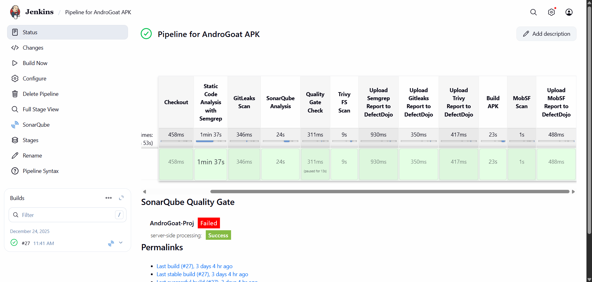
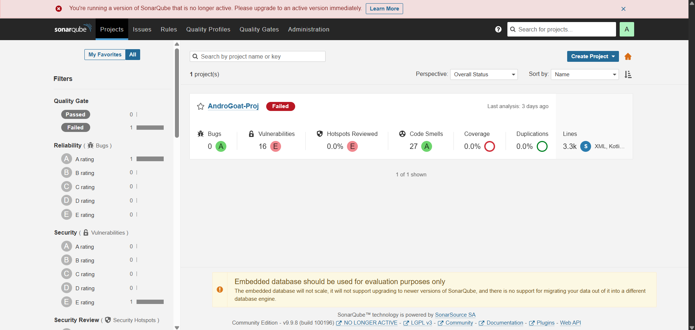
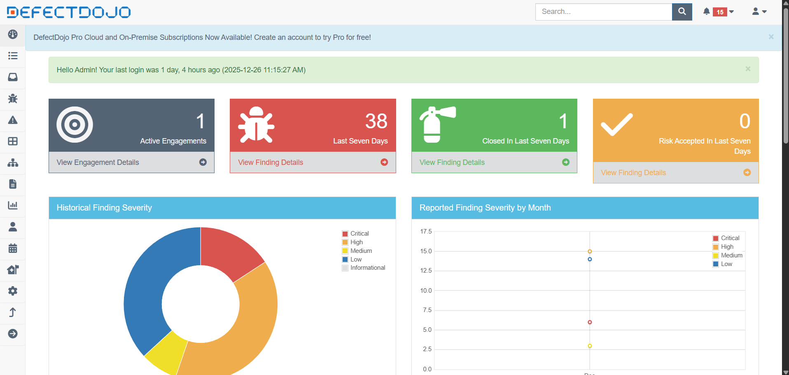

# Designing a Comprehensive DevSecOps Pipeline for Android Applications

## Introduction

As mobile applications evolve rapidly, security can no longer be treated as a post-deployment activity. Modern DevSecOps practices emphasize **continuous security testing**, ensuring vulnerabilities are identified early, tracked centrally, and remediated efficiently.

In this project, I implemented a **fully automated DevSecOps pipeline for Android applications** using Jenkins. The pipeline integrates multiple industry-standard security tools to cover source code analysis, secrets detection, dependency and filesystem scanning, and mobile-specific vulnerability assessment.

The objective was simple: **every build should be automatically tested, scanned, and reported without manual intervention**.

---

## High-Level Architecture

The solution was deployed across **two AWS EC2 instances** to maintain separation of concerns and improve overall stability and performance.

### EC2 Instance 1 – CI & Build Environment

This instance hosted:

- **Jenkins** for CI/CD orchestration
    
- **Android SDK & Gradle** for building APKs
    
- Multiple **security scanning tools**
    
- Pipeline execution and artifact management
    

### EC2 Instance 2 – Security Services

This instance hosted:

- **MobSF** – Mobile application security testing
    
- **SonarQube** – Code quality and static analysis
    
- **DefectDojo** – Centralized vulnerability management
    

While this entire setup can be deployed locally, I chose AWS to better simulate a **real-world enterprise environment** and gain hands-on cloud experience.

---
## Connecting with the Machines

You can use any preferred method to connect to the EC2 instances. I used [MobaXterm](https://mobaxterm.mobatek.net/) for SSH access and session management.

### Security Groups

To avoid repeatedly modifying firewall rules during setup, I opened a broader range of ports to support all required services.

Elastic IPs were also assigned to both instances for consistent access. AWS documentation for this can be found [here](https://docs.aws.amazon.com/AWSEC2/latest/UserGuide/working-with-eips.html).

---

## Jenkins Setup

Jenkins was used as the central CI/CD orchestrator for the entire DevSecOps pipeline. It was deployed on a dedicated AWS EC2 instance running Ubuntu, isolated from scanning tools to keep the architecture clean and modular.

**Key setup steps:**

- Installed Jenkins on Ubuntu with OpenJDK as the runtime.
- Configured required plugins, including:
    - Pipeline
    - Git
    - Credentials Binding
    - DefectDojo Plugin
- Set up secure credentials for:
    - Git repository access
	- MobSF API key
	- DefectDojo API key
- Configured Jenkins agents to run builds and security scans efficiently.
- Installed and configured required tools on the Jenkins node, such as:
    - Android build dependencies
    - SDK Manager    
    - CLI utilities for API-based integrations
        
**Pipeline design:**

- Gets the Repo and performs security testing.
- Builds the Android APK.
- Automatically sends the generated artifact to MobSF for static analysis.
- Collects scan results and forwards them to DefectDojo for centralized vulnerability management.

This setup allowed Jenkins to act as a single control point, ensuring consistent, repeatable, and automated security testing across the pipeline.

---
## Security Tools Integrated

Each tool in the pipeline addresses a specific attack surface:

- **Semgrep** – Static code analysis using security rules
    
- **Gitleaks** – Detection of hardcoded secrets and credentials
    
- **SonarQube** – Code quality, bugs, and security hotspots
    
- **Trivy (Filesystem Scan)** – Dependency and filesystem vulnerability scanning
    
- **MobSF** – Android APK static analysis
    
- **DefectDojo** – Centralized vulnerability aggregation and tracking
    

---

## Pipeline Workflow

### 1. Source Code Checkout

The pipeline begins by pulling the Android application source code from GitHub. For this project, I used the intentionally vulnerable [AndroGoat](https://github.com/satishpatnayak/AndroGoat) repository.

---

### 2. Static Code Analysis – Semgrep

Semgrep is executed using Docker to scan the codebase against predefined security rules.  
A JSON report is generated and stored for later processing.

To use Semgrep, an account must be created at [semgrep.dev](https://semgrep.dev/), and an API token generated via **Settings → Tokens → API Tokens**.  
This token is stored securely in Jenkins credentials and referenced within the pipeline.

---

### 3. Secrets Detection – Gitleaks

Gitleaks scans the repository for exposed credentials, API keys, and other sensitive secrets.

Since AndroGoat is intentionally vulnerable, Gitleaks findings were configured **not to fail the pipeline**. In a production environment, however, any secrets detection should immediately block the build until resolved.

---

### 4. Code Quality & Security – SonarQube

SonarQube was deployed following the official documentation:

- Server setup:  
    [https://docs.sonarsource.com/sonarqube-server/10.5/setup-and-upgrade/install-the-server/installing-sonarqube-from-docker](https://docs.sonarsource.com/sonarqube-server/10.5/setup-and-upgrade/install-the-server/installing-sonarqube-from-docker)
    
- Jenkins integration:  
    [https://docs.sonarsource.com/sonarqube-server/10.8/analyzing-source-code/ci-integration/jenkins-integration/global-setup](https://docs.sonarsource.com/sonarqube-server/10.8/analyzing-source-code/ci-integration/jenkins-integration/global-setup)
    

SonarQube analyzes the codebase for:

- Bugs
    
- Code smells
    
- Security hotspots
    
- Maintainability issues
    

A **quality gate** is enforced to ensure minimum code quality standards are met before proceeding.

---

### 5. Filesystem Vulnerability Scan – Trivy

Trivy was installed following the official setup guide:  
[https://trivy.dev/docs/latest/getting-started/installation/](https://trivy.dev/docs/latest/getting-started/installation/)

It performs filesystem scans to detect:

- Vulnerable dependencies
    
- Misconfigurations
    
- Known CVEs
    

Scan results are exported in JSON format for centralized reporting.

---

### 6. Centralized Reporting – DefectDojo

Centralized vulnerability management was a key requirement for this project. After evaluating multiple options, I selected OWASP’s [DefectDojo](https://docs.defectdojo.com/en/about_defectdojo/about_docs/).

DefectDojo was deployed using the official repository:  
[https://github.com/DefectDojo/django-DefectDojo](https://github.com/DefectDojo/django-DefectDojo)

Integration with Jenkins is simplified through a dedicated [DefectDojo Jenkins plugin](https://github.com/DefectDojo/django-DefectDojo). The plugin allows automatic generation of pipeline snippets for supported tools.

  
  
  

The following reports are automatically uploaded to DefectDojo:

- Semgrep results
    
- Gitleaks findings
    
- Trivy scan results
    

This creates a **single source of truth** for all security findings across the pipeline.

---

### 7. APK Build

Once all code-level checks complete, Jenkins builds the Android debug APK using Gradle.  
The generated APK serves as the input for mobile-specific security testing.

Android SDK setup was performed using official Android documentation.

---

### 8. Mobile Security Testing – MobSF

MobSF was deployed using the official guide:  
[https://mobsf.github.io/docs/#/running_mobsf_docker](https://mobsf.github.io/docs/#/running_mobsf_docker)

The MobSF API key can be found at:  
`http://<mobsf-url>/api_docs`

The API key is stored securely in Jenkins credentials and referenced during pipeline execution.

The pipeline automatically:

1. Uploads the APK to MobSF via REST API
    
2. Triggers a security scan
    
3. Retrieves a **JSON security report**
    

MobSF analyzes:

- AndroidManifest configurations
    
- Permissions
    
- Hardcoded secrets
    
- Cryptographic weaknesses
    
- Insecure API usage
    

The resulting JSON report is then uploaded to DefectDojo.

---

## Conclusion

This project demonstrates a **production-grade DevSecOps pipeline for Android applications**, integrating security checks across every stage of the CI/CD lifecycle.

By combining Jenkins, Semgrep, Gitleaks, SonarQube, Trivy, MobSF, and DefectDojo on AWS infrastructure, the pipeline enables continuous security testing without slowing down development.

The final result is a scalable, automated, and centralized security workflow that reflects real-world DevSecOps practices and provides a strong foundation for secure mobile application delivery.

---
### Future Improvements

This project was built primarily for learning and hands-on experimentation, so some design choices were kept simple (for example, using a public GitHub repository). There are several clear areas where the pipeline can be enhanced and extended further:

- **GitHub Webhooks**  
    The pipeline can be triggered automatically on every code push or pull request using GitHub webhooks. This would enable true continuous integration instead of manual or scheduled runs.
    
- **Private Repositories & Access Control**  
    In a production setup, the pipeline should be connected to private repositories with proper access controls, secrets management, and role-based permissions.
    
- **DAST Integration**  
    Dynamic Application Security Testing (DAST) tools can be added to test the running application or backend APIs. This would complement the existing SAST and mobile static analysis, providing broader security coverage.
    
- **AI & LLM Integration (MCP)**  
    AI and LLMs can be integrated to:
    
    - Automatically analyze scan results and reduce false positives
        
    - Prioritize vulnerabilities based on risk and context
        
    - Generate remediation guidance for developers
        
    - Correlate findings across multiple tools using an MCP-style orchestration layer
        
- **Scalability & Optimization**  
    The pipeline can be optimized to handle parallel builds, queued scans, and resource limits to prevent system overload in high-frequency environments.
    

These improvements would move the pipeline from a learning-focused implementation to a production-grade DevSecOps system.
